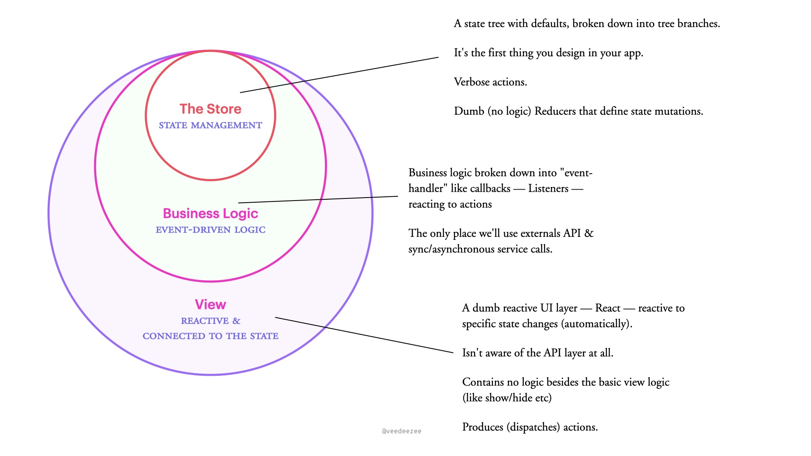
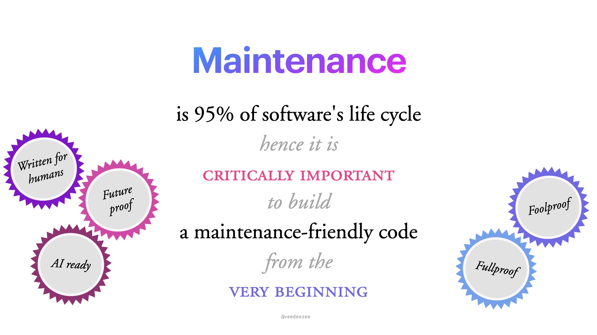
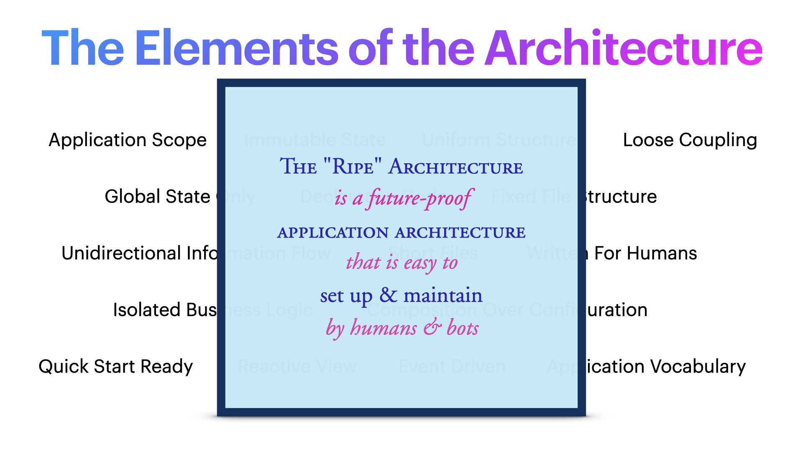

<p align="center">
  
</p>

<h3 align="center">The front-end architecture that makes you want to write more code.</h3>

<p align="center">
  <a href="https://www.npmjs.com/package/ripe-skills"></a>
  <a href="https://github.com/vdz/ripe-skills/blob/main/LICENSE"></a>
</p>

---

## The Problem

Every front-end codebase hits a wall. New features get harder. Onboarding takes longer. The 10th developer adds code the 1st developer can't recognize. AI agents produce code that *works* but doesn't *fit*.

**The Ripe Method fixes this.** It's a front-end architecture where functional complexity grows with your product, but technical complexity stays flat.

```
Functional complexity:  ↗ growing with features — that's expected
Technical complexity:   → flat forever — that's the architecture
```

<p align="center">
  
</p>

---

## What is The Ripe Method?

A complete front-end architecture for **React + Redux Toolkit** that enforces strict separation of concerns across three layers:

<p align="center">
  
</p>

| Layer | What it does | What it never does |
|-------|-------------|-------------------|
| **Store** | Holds state, defines actions, simple reducers | Logic, API calls, decisions |
| **Business Logic** | Listeners orchestrate: API calls, decisions, side effects | Rendering, direct state mutation |
| **View** | Renders UI, dispatches actions | Logic, API calls, state management |

The rule: **push complexity inward.** The View is dumb. The Reducers are dumb. All the thinking happens in Listeners.

<p align="center">
  
</p>

---

## Why Ripe?

### Battle-tested at scale

Born inside a B2C company that grew from 90 to 900+ developers. Dozens of client-facing applications — retail management, logistics, self-help portals, mobile — all built on the same architecture. The method survived 10x team scaling while keeping code complexity a plateau.

### Built for the agentic age

In 2026, we don't just write code — we orchestrate AI agents that write code. The Ripe Method is structured so that an LLM with a context window can navigate, understand, and generate code that fits. Every component, every store branch, every listener follows the same patterns. No tribal knowledge. No "you had to be there."

### Maintenance is 95% of the game

<p align="center">
  
</p>

Every architectural decision is evaluated through one lens: *will this make maintenance easier or harder?* Ripe optimizes for the 95% of a product's life spent maintaining, extending, and evolving — not the 5% spent in greenfield excitement.

### The 16 Elements

<p align="center">
  
</p>

<details>
<summary><strong>Expand to see all 16 elements</strong></summary>

| Category | Element | What it means |
|----------|---------|---------------|
| **State** | Application Scope | Every feature belongs to a defined scope with clear boundaries |
| | Immutable State | Never mutate state directly — create new versions |
| | Global State Only | One source of truth: the global store |
| **Code Style** | Declarative Code | Describe *what* you want, not *how* to get it |
| | Written For Humans | Optimize for readability — clear names, short functions |
| | Short Files | ~100 lines per file. Longer? Split it |
| **Structure** | Uniform Structures | Similar things look similar — same shape everywhere |
| | Fixed File Structure | Same folder layout, every project. Navigate blindfolded |
| | Loose Coupling | Modules depend on abstractions, not implementations |
| **Data Flow** | Unidirectional Flow | Action → Reducer → State → View. Never backwards |
| | Reactive View | The view reacts to state. It doesn't fetch or decide |
| | Event Driven | User interactions trigger actions that describe what happened |
| **Logic** | Isolated Business Logic | All logic lives in listeners. Not scattered across components |
| | Composition Over Configuration | Build complex features by combining simple pieces in JSX |
| | Quick Start Ready | Clone, install, run. No tribal knowledge required |
| **Vocabulary** | Application Vocabulary | Actions are the feature spec — reading them tells you what the app does |

</details>

---

## Quick Start

```sh
npx ripe-skills
```

That's it. All skills are installed into `~/.claude/skills/`. Claude Code knows how to build Ripe apps.

### Your first Ripe app

```sh
# Start a new project
claude
> /ripe-init

# Add a feature
> "Create a products store branch with fetch, success, and failure actions"
> "Create a ProductCard component that reads from the products store"
> "Add a /products route with preemptive hydration"
```

Claude follows the Ripe skills automatically — correct file structure, correct patterns, correct separation of concerns.

### Commands

```sh
npx ripe-skills                    # Install all skills
npx ripe-skills add <skill-name>   # Install a single skill
npx ripe-skills list               # Show available skills + install status
```

---

## The Skills

Four skills that teach Claude Code the complete Ripe architecture:

| Skill | Lines | What Claude Learns |
|---|---|---|
| **`ripe-init`** | 99 | Scaffold a new project: Vite, TypeScript, Redux store, routing, CLAUDE.md |
| **`building-ripe-store`** | 405 | Store branches: actions, reducers, listeners, API functions, dual-structure state |
| **`building-ripe-components`** | 238 | Component anatomy, semantic TSX, two-level aliases, styled-components, composition |
| **`building-ripe-routing`** | 263 | React Router + `setLocation` bridge, preemptive hydration via listeners |

Skills follow [Anthropic's best practices](https://docs.anthropic.com/en/docs/agents-and-tools/agent-skills/best-practices) — all SKILL.md files under 500 lines. Reference material uses progressive disclosure (loaded only when needed):

<details>
<summary><strong>Full skill architecture</strong></summary>

```
building-ripe-components/
  SKILL.md                 238 lines  Component patterns
  patterns.md                         Before/after examples
  styled.md                           Naming conventions

building-ripe-store/
  SKILL.md                 405 lines  Store patterns
  listeners.md                        Listener patterns
  state-shape.md                      State shape design

building-ripe-routing/
  SKILL.md                 263 lines  Routing patterns

ripe-init/
  SKILL.md                  99 lines  Scaffolding checklist
  claude-md-template.md               CLAUDE.md scaffold
  config-templates.md                 Config file templates
  store-templates.md                  Store file templates
  app-templates.md                    App + routing templates
```

</details>

---

## Why This Tech Stack?

| Choice | Why |
|--------|-----|
| **React** | The dominant UI library. 3M+ weekly npm downloads. Massive ecosystem, talent pool, and tooling |
| **Redux Toolkit** | Predictable state management with a complete information cycle. Time-travel debugging. The most *predictable* tool — and predictability matters when half your team is AI agents |
| **Listener Middleware** | RTK's built-in replacement for thunks/sagas. Listeners react to any action, run async logic, and dispatch results. No extra dependencies |
| **styled-components** | Co-located styles with full CSS power. Class-based state styling. No Tailwind utility soup in your semantic JSX |
| **Vite** | Sub-second HMR. Native ESM. The build tool that doesn't make you wait |
| **TypeScript** | Strict mode. Types are documentation that the compiler enforces |
| **Vitest** | Vite-native testing. Fast, compatible with Jest APIs, zero config |

### Who uses React + Redux?

This isn't a niche stack. It's battle-tested at the largest scale:

- **Netflix** — Redux + redux-observable for concurrent async streams across their web UI
- **Uber** — Built Fusion.js, an entire framework with Redux as a first-class citizen. Hundreds of internal apps
- **Shopify** — Migrated their POS app from vanilla Redux to Redux Toolkit. Published a detailed case study
- **Airbnb** — Redux for committed/shared state, React state for ephemeral UI interactions
- **Twitter/X** — Normalized entity store with ID-based relationships across timelines
- **Dropbox** — Built the Rondo Framework on top of Redux to solve type-safe code splitting

---

## One More Thing

### Why "Ripe"?

Because the architecture is *ready*. Not green, not overcooked — ripe. Ready to be picked up and used. Ready to grow. Ready for whatever comes next.

The Ripe Method doesn't fight the future. It embraces it. When AI agents became the new team members in 2025, Ripe codebases were already structured for them — predictable, navigable, and simple enough that a fresh context window produces correct code on the first try.

That's not an accident. That's what happens when you optimize for maintenance from day one.

---

## Learn More

- **[The Ripe Method — Full Guide](ripe-architecture-docs/the-ripe-method.md)** — the complete architecture document with diagrams and examples
- **[the-ripe-architecture](https://github.com/vdz/the-ripe-architecture)** — the architecture repo

## License

MIT

---

<p align="center">
  <em>Created by <a href="https://github.com/vdz">Yehuda Gilead</a> | 2026</em>
</p>
